# 딥러닝을 활용한 사용자 맞춤형 키오스크 프로그램   
## (customized-kiosk-program-using-deep-learning)
 

⚠️ 본 게시물에 포함된 프로젝트는 작성자의 졸업작품으로, 무단 복제 및 배포, 상업적 이용을 금지합니다. 
해당 내용을 활용할 경우 출처를 명시해주시기 바랍니다.
 
 
 

## 📖 프로젝트 개요
본 프로젝트는 디지털 소외계층의 진입장벽을 해소하기 위해   
**딥러닝의 CNN 알고리즘**과 디자인의 IxD(인터랙션 디자인 : Interaction Design)를 접목하여,   
키오스크의 기본적인 성능과 UX를 향상시킨 **사용자 맞춤형 키오스크 프로그램**을 설계하고 구현한 프로젝트이다.

---
 

## ✨ 프로젝트 특징
* 모든 연령대가 이용하는 **패스트푸드점 키오스크**를 기본 모델로 제작했다.
* 디지털 소외계층에 해당되는 **고령층**과 이에 해당되지 않는 **청년층**을 위한 UI를 구성했으며,   
  사용자가 주문 시작 화면에서 **얼굴 인식(연령대 인식)** 을 진행하면   
  ➜ 각 연령에 맞는 UI로 화면이 **자동 전환**되는 방식으로 구현했다.
* 각 사용자의 **선호 색상 기반 UI**를 구성했으며, 기존의 패스트푸드점 키오스크보다   
  **가독성을 대폭 강화**하여 화면을 재구성했다.

---
 

## 🛠 기술 스택

### 💻 Frontend

### ⚙️ Backend

### 🤖 AI / ML

---
 
 

## ⚙ 프로그램 작동 원리

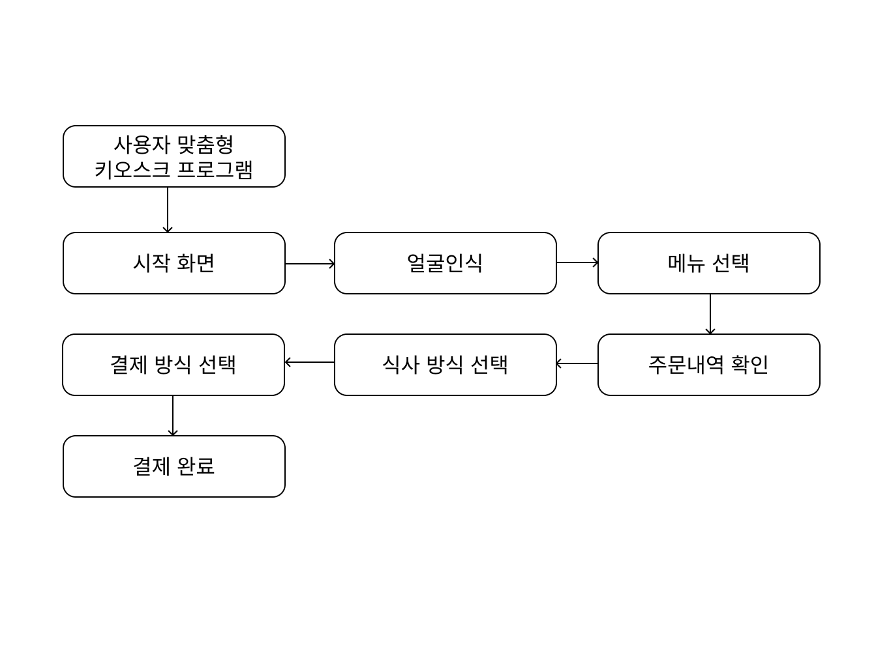

전체적인 사용자 맞춤형 키오스크 프로그램의 진행 과정이다.

---

 

## 🏗 시스템 구조

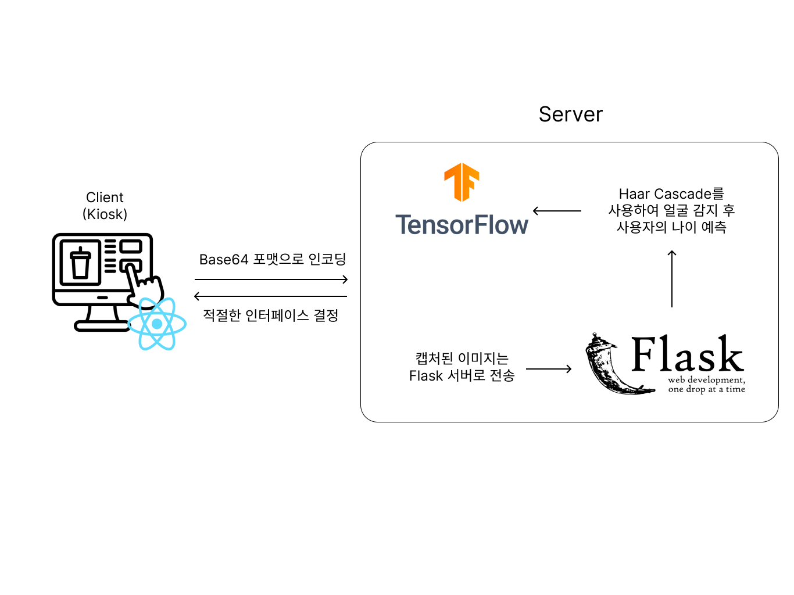

본 시스템은 React 기반 프론트엔드와 Flask 기반 백엔드로 구성된 클라이언트-서버 구조를 기반으로 동작한다. 
사용자가 키오스크 화면 앞에 서면, 프론트엔드는 웹캠을 통해 이미지를 캡처하고 
이를 Base64로 인코딩하여 REST API를 통해 서버로 전송한다.

Flask 백엔드는 수신된 이미지를 디코딩한 후 OpenCV를 활용해 전처리를 수행하고, 
Haar Cascade를 통해 얼굴을 검출한다. 
이후 TensorFlow 기반 딥러닝 모델을 이용하여 사용자의 연령대를 예측한다.

예측 결과에 따라 청년층, 고령층에 맞는 사용자 인터페이스가 결정되며, 
프론트엔드는 서버로부터 받은 결과를 기반으로 해당 UI로 동적으로 전환한다. 
이를 통해 사용자 맞춤형 인터페이스를 실시간으로 제공한다.

---
 

## 🤖 CNN 알고리즘

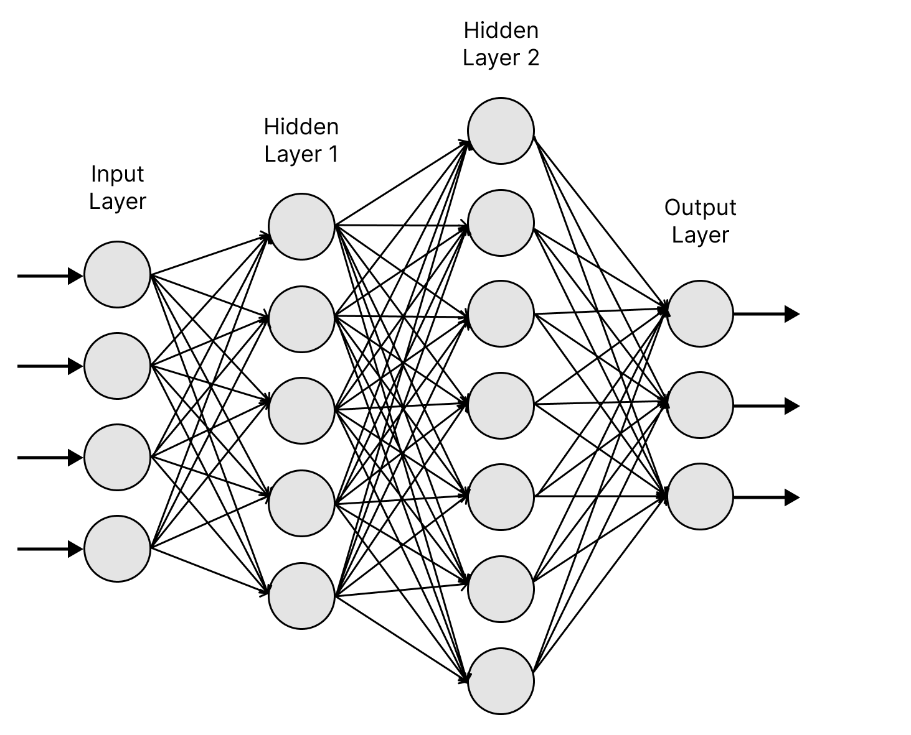

본 프로젝트에서는 이미지 기반 연령 예측을 위해 CNN(Convolutional Neural Network)을 활용하였다. 
CNN은 이미지와 같은 2차원 데이터를 처리하는 데 특화된 딥러닝 모델로, 
Convolution Layer, Pooling Layer, Fully Connected Layer로 구성된다.

Convolution 연산을 통해 이미지의 특징을 추출하고, 
Pooling을 통해 데이터 크기를 줄이면서 중요한 정보만 유지하여 효율적인 학습이 가능하다. 
이러한 구조를 통해 CNN은 이미지의 패턴을 효과적으로 인식하며, 
비교적 적은 연산으로 높은 정확도의 예측 성능을 보인다.

본 시스템에서는 해당 CNN 기반 모델을 활용하여 사용자 얼굴 이미지로부터 연령대를 예측하고, 
이에 따라 맞춤형 UI를 제공한다.

---
 
 

## 🖥 시연 화면  
프로젝트의 시연 화면으로, 기본 UI를 포함하여 
청년층, 고령층으로 구성된 다양한 사용자 맞춤형 인터페이스를 확인할 수 있다.

 

### 1. 기본 UI
### 1-1. 주문 시작 기본 화면

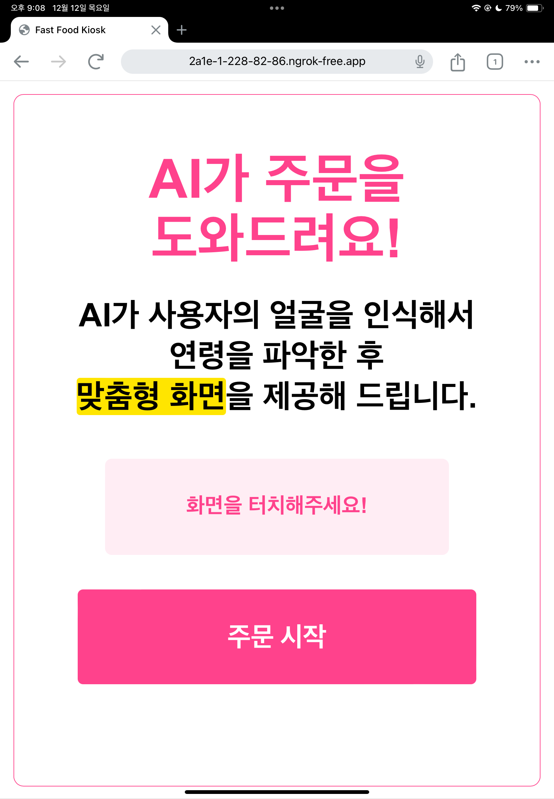

 
 

### 1-2. 얼굴 인식 기본 화면

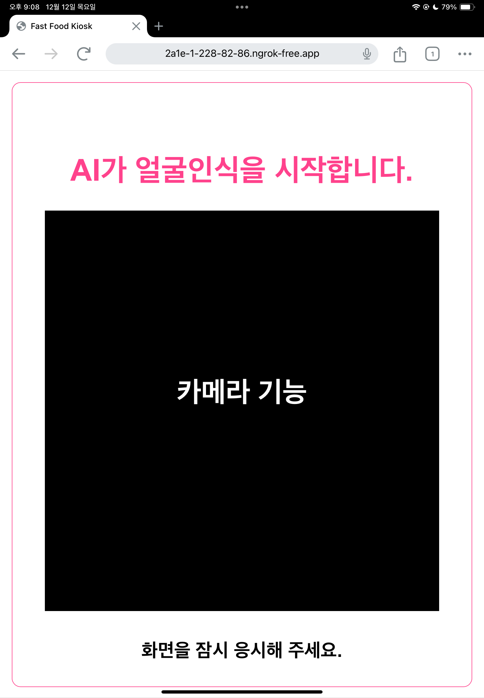
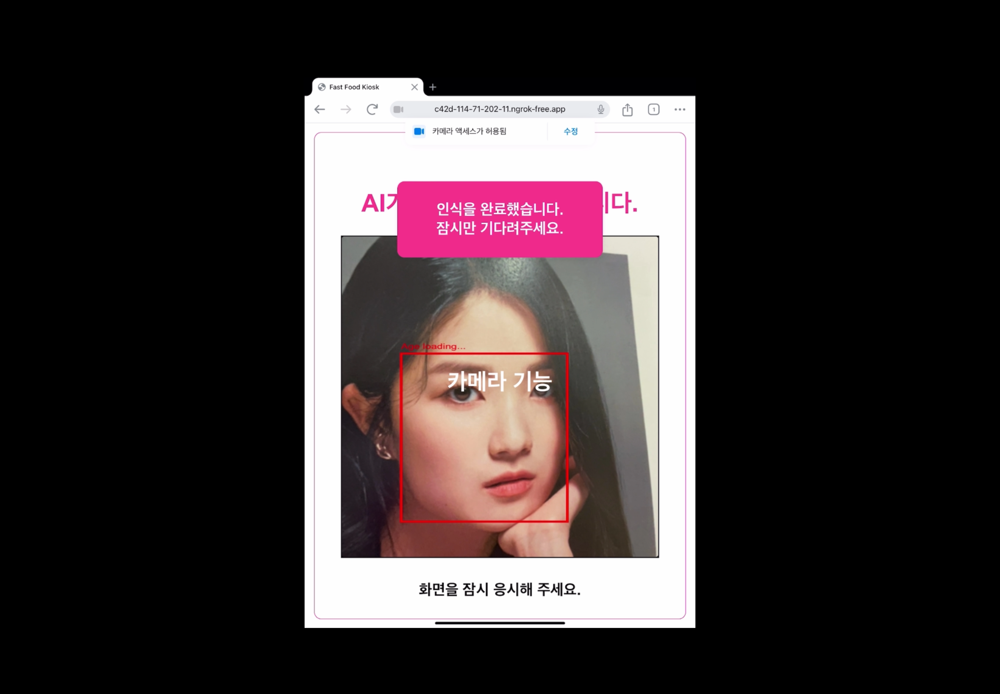

 

---

 

### 2. 청년층용 UI
### 2-1. 청년층용 메뉴 선택 화면

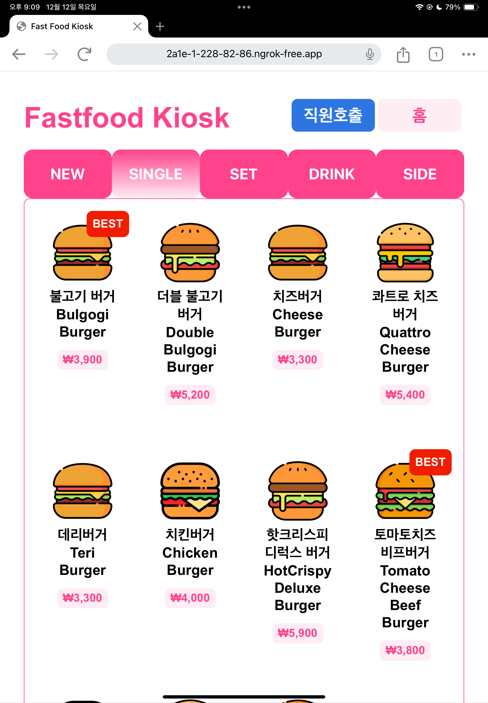

 
 

### 2-2. 청년층용 주문 내역 확인 화면

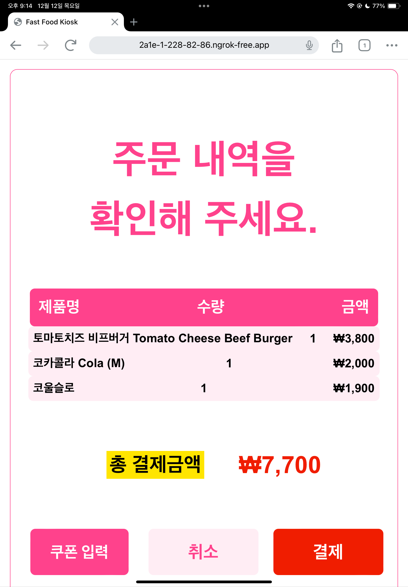

 
 

### 2-3. 청년층용 결제 방식 선택 화면

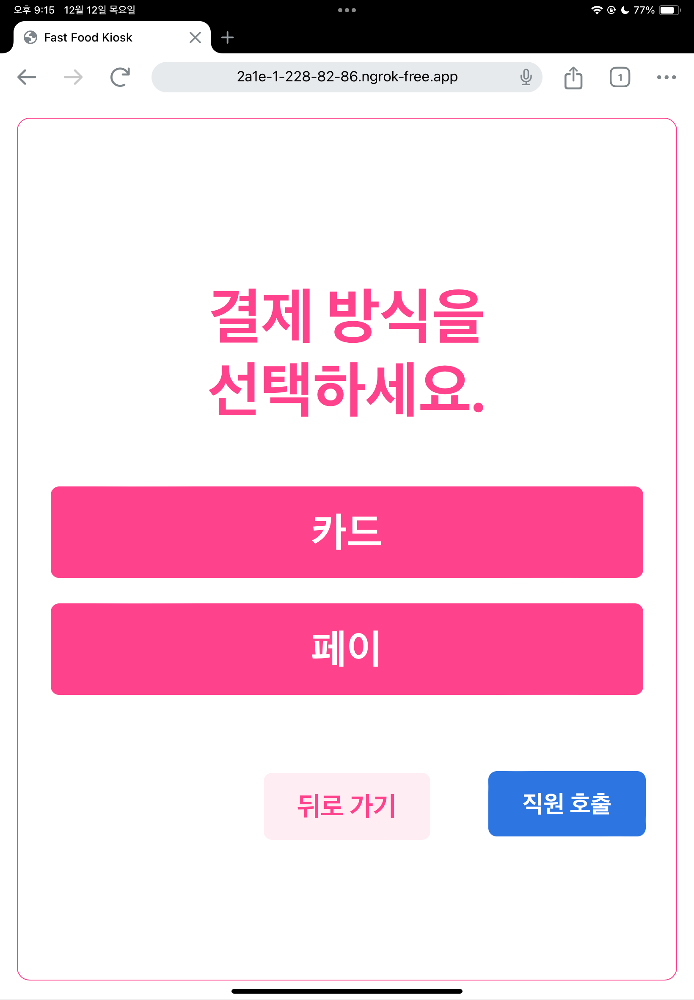

 
 

### 2-4. 청년층용 결제 방식 선택 화면 (카드 선택)

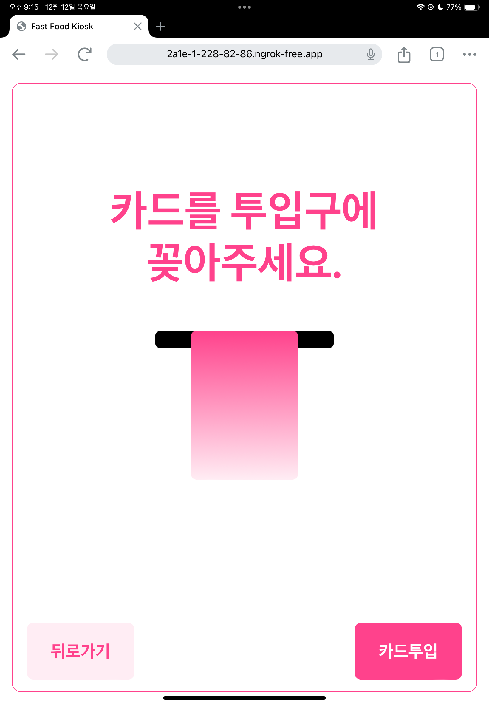

 
 

### 2-5. 청년층용 결제 방식 선택 화면 (페이 선택)

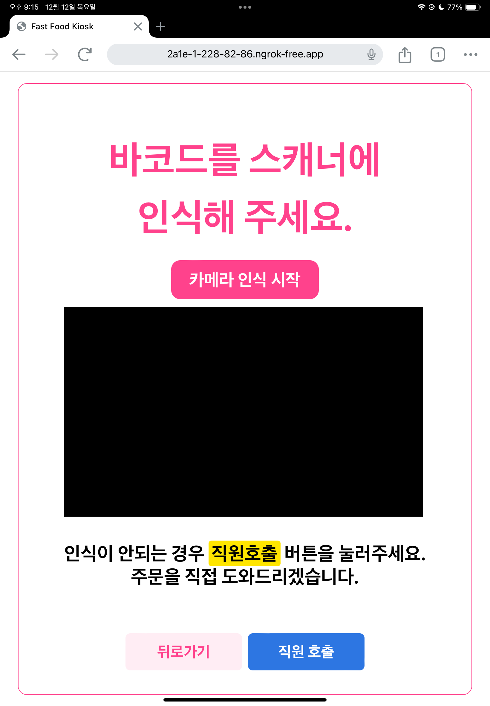

 
 

---

### 3. 고령층용 UI
### 3-1. 얼굴 인식 기본 화면

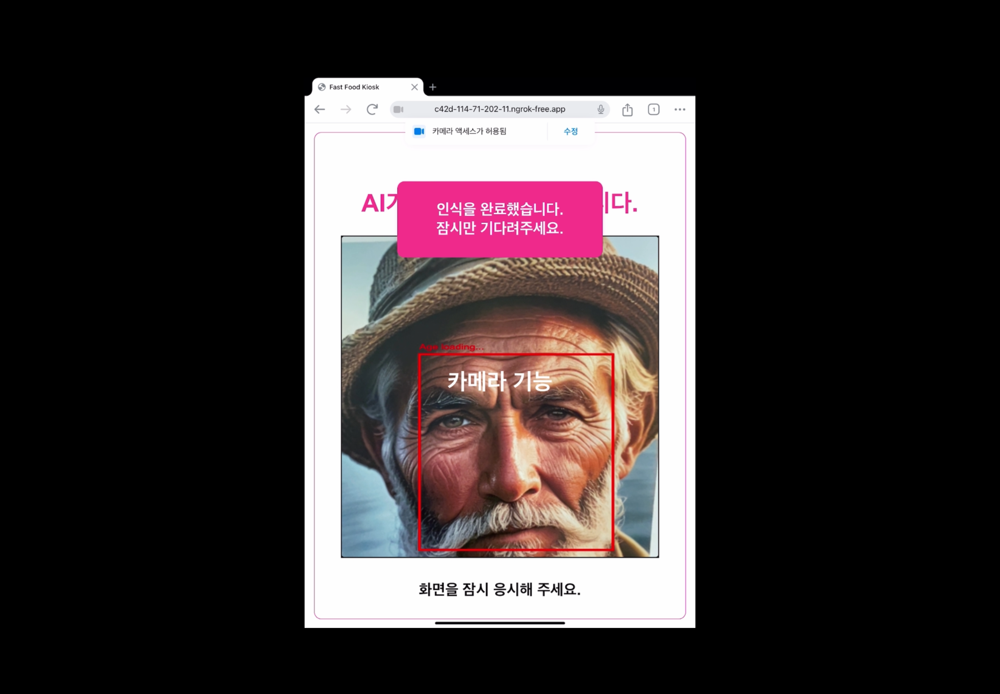

 
 

### 3-2. 고령층용 메뉴 선택 화면

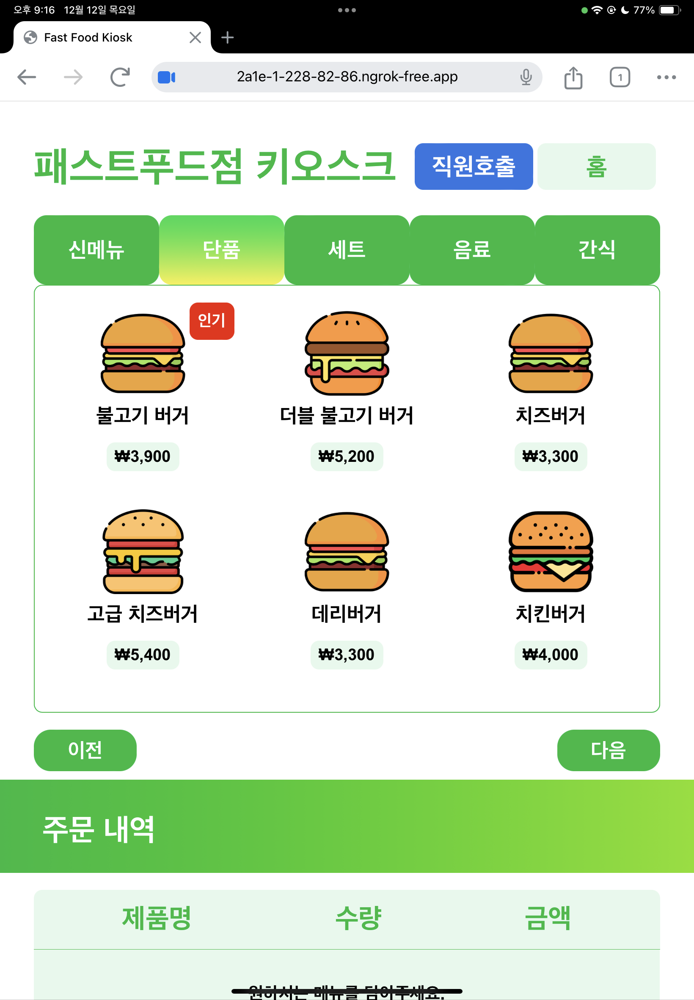

 
 

---
 
 

## 📽 시연 영상

프로젝트의 전체 동작 흐름과 주요 기능은 아래 시연 영상을 통해 확인할 수 있다.

👉 [시연 영상 보러가기](https://velog.io/@nextwave/딥러닝을-활용한-사용자-맞춤형-키오스크-프로그램-시연-영상)